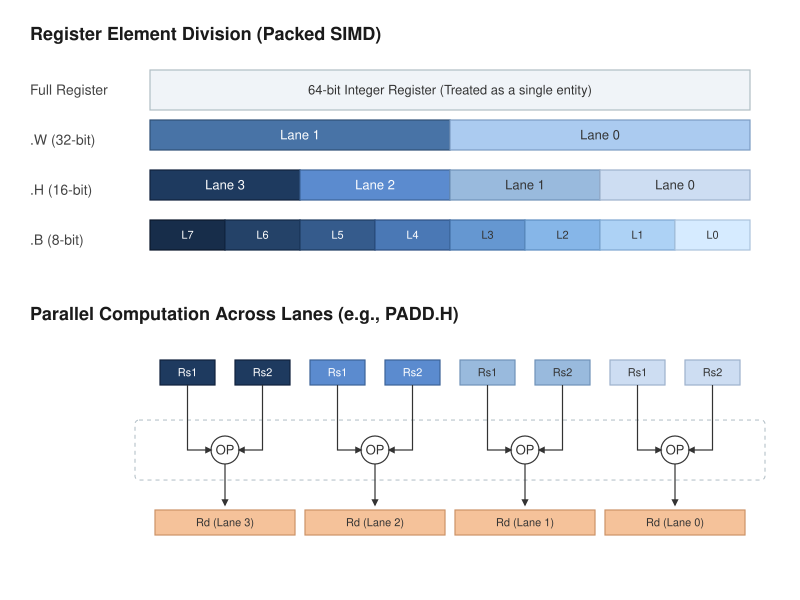
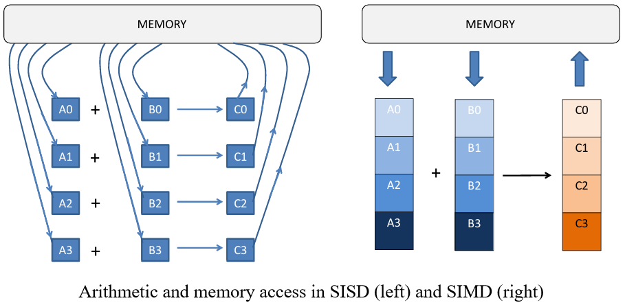
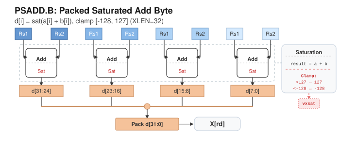
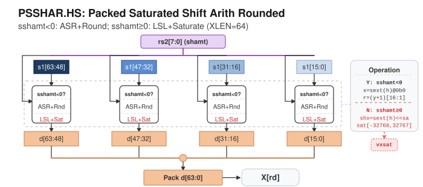
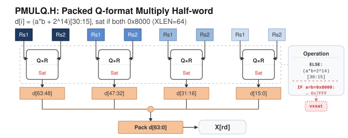
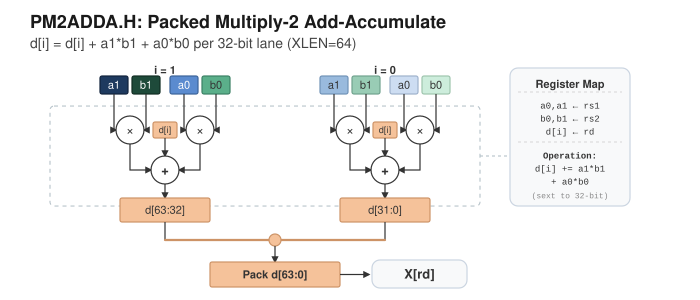

# RISC-V P 扩展（DSP/Packed-SIMD）综合调研报告

> **主要内容基于 P-ext-proposal v0.20-draft**

---

## 目录

[toc]

---

## 一、背景与调研范围

### 1.1 文档状态

- **当前版本**：v0.20-draft（修订日期 2026-03-17）
- **文档状态**：`Development state — Assume anything can change`
- **结论**：该草案可用于架构与指令族调研，但**不应直接视为冻结标准**，实现与产品规划应预留变更空间

### 1.2 调研口径

本报告围绕"RISC-V 标准公开的 DSP 扩展指令集内容及架构"，按三条标准筛选调研方向：

| 标准                 | 说明                                                        |
| -------------------- | ----------------------------------------------------------- |
| **业务收益**   | 对典型 DSP 内核（滤波、卷积、音频、控制环）加速收益是否明显 |
| **实现风险**   | 微架构复杂度、工具链可达性、验证成本是否可控                |
| **草案敏感度** | 该部分是否容易受规范演进影响，是否需要提前做变更缓冲        |

### 1.3 五大调研方向总览

| 方向                              | 核心价值                                             |
| --------------------------------- | ---------------------------------------------------- |
| 高价值指令子集语义                | 快速证明 P 扩展"有用"，直接决定性能收益              |
| RV32 双寄存器机制与 RV64 统一抽象 | 降低架构/实现返工，实现复杂度最高的结构性问题        |
| 编译器与汇编器可达性              | 打通从代码到指令的链路，没有工具链则指令价值无法落地 |
| 微架构代价与时序风险评估          | 明确面积/频率/功耗边界，决定是否能上产品线           |
| 全球 RISC-V DSP 扩展厂商          | 降低选型与合作风险，立项依赖生态成熟度               |

---

## 二、P 扩展架构总览

### 2.1 定位与目标

P 扩展面向 DSP / 多媒体 / 控制类负载，核心特征：

- **Packed-SIMD 计算模型**：一个整数寄存器按元素宽度切分为多个 lane 并行计算
- 元素宽度：`.B`（8-bit）、`.H`（16-bit）、`.W`（32-bit）
- 执行载体是**通用整数寄存器**，非向量寄存器体系
- 依赖扩展：`Zmmul`、`Zba`、`Zbb`
- 适用架构：RV32 (RV32E?) 与 RV64





> Figure 2截取自附录 Aalto P-extension ALU 论文

### 2.2 指令族版图（30 大功能族）

P 扩展是一套系统化的 DSP 指令簇，按功能可归纳为：

| 序号 | 功能族                                    | 序号 | 功能族                                           |
| ---- | ----------------------------------------- | ---- | ------------------------------------------------ |
| 1    | Load Immediate（打包立即数装载）          | 16   | Misc Scalar / Double-wide Scalar Add/Sub         |
| 2    | Basic Packed Add/Subtract                 | 17   | Widening Add/Sub、Widening Shift、Widening Zip   |
| 3    | Saturating Add/Subtract                   | 18   | Narrowing Shift / Narrowing Clip                 |
| 4    | Averaging Add/Subtract                    | 19   | Multiply High（same-width）                      |
| 5    | Shift-Add                                 | 20   | Q-format Multiply                                |
| 6    | Add-Subtract Cross                        | 21   | Multiply-High Accumulate                         |
| 7    | Absolute Difference / Saturating Absolute | 22   | Q-format Multiply-Accumulate                     |
| 8    | Reduction Sum（含 double-wide）           | 23   | Cross-element Multiply                           |
| 9    | Min/Max、Comparison                       | 24   | Cross-element Multiply-Accumulate                |
| 10   | Sign Extension                            | 25   | PM2/PM4 Horizontal Multiply-Add/Sub              |
| 11   | Saturation/Clipping                       | 26   | Mixed-width Multiply-High                        |
| 12   | Shift Operations                          | 27   | Widening Multiply / Widening Multiply-Accumulate |
| 13   | Saturating/Rounding Shift                 | 28   | Widening Q-format Multiply-Accumulate            |
| 14   | Pair Operations                           | 29   | Widening PM2 Multiply-Add/Sub                    |
| 15   | Zip/Unzip/Byte-Reverse                    | 30   | RV32 Double-Register Equivalences                |

#### 2.2.1 现存两版草案由来与精炼对比（v0.9.x vs v0.20）

为避免把历史文本、工作草案与工程分支混为一谈，这里先给出两条版本脉络的可执行口径：

- **v0.9.x 脉络（晶心科技早期捐赠，工程落地起点）**：来自早期 `riscv-p-spec` 文档体系（仓库 `old-doc` 线），并在公开工具链分支中可见对应实现路径（README 已列出 v0.9.11 对应 gcc/binutils 入口）。
- **v0.20 脉络（基于 John Hauser 的草案，本报告主线）**：由 `riscv-p-spec` 主仓持续维护，README 明确标注为 working draft / currently draft version；本报告后续语义与架构分析均按该草案展开。
- **历史章节口径提醒**：官方 ISA 文档中的 "P extension version 0.2" 更接近历史阶段文本，不等价于当前 `v0.20-draft` 工作草案；工程实现需显式标注引用版本与日期。

| 维度              | v0.9.x（以 0.9.11 为代表）                 | v0.20-draft                                       | 工程影响                                         |
| ----------------- | ------------------------------------------ | ------------------------------------------------- | ------------------------------------------------ |
| 文档定位          | 早期工程化提案，生态中已有历史实现与分支   | 当前工作草案（Development state）                 | 立项时需先锁定目标版本，避免“同名不同语义”     |
| 命名体系          | 传统短助记符风格占比更高（如 K* 族）       | 更强调 `P<op>.<S>` 与宽化/窄化/双宽后缀体系     | 有利于自动化生成汇编语法、文档与 operand checker |
| RV32 双寄存器表达 | 部分语义依赖历史约定，工具实现常需额外约束 | 通过 `rd_p/rs1_p/rs2_p` 与 `.D*` 规则显式建模 | 前端合法性检查、调度约束与验证口径更易统一       |
| 依赖扩展与模块化  | 历史版本存在与位操作子集耦合较深的实现习惯 | 明确依赖 `Zmmul`、`Zba`、`Zbb`              | 有利于复用标准扩展能力并控制实现边界             |
| 编码/解码组织     | 工程资料常偏“逐指令落地”                 | 可按主类型 + 拓扑族进行模板化归类                 | 解码器与 operand checker 更适合参数化实现        |
| 工具链可达性      | 可通过历史分支与 `.insn` 路径落地        | 处于实验/演进态，需按版本号精确匹配               | 建议先打通 L0/L1，再推进 intrinsic 与自动选择    |

**建议采用策略**：主报告保持 v0.20 语义主线；若项目需对接既有生态，再单列 v0.9.x 兼容映射（助记符、编码别名、测试向量三张表）作为迁移附件。

来源交叉：`riscv-p-spec` README、`P-ext-proposal v0.20-draft`、docs.riscv.org 的 `p-st-ext v0.2` 页面。

### 2.3 命名与编码规律

- **基本形式**：`P<operations>.<S>`
- **标量第二操作数**：后缀再加 `S`（如 `.HS`/`.BS`/`.DHS`）
- **双宽（RV32）**：`.DB`/`.DH`/`.DW`
- **宽化/窄化**：`W*`/`N*` 前缀
- **横向归约**：`2ADD`、`4ADD`、`REDSUM`/`SUM`
- **乘法缩写**：`MUL→M`，`MULHR→MHR`，`MULQ→MQ`

### 2.4 关键数值语义

P 扩展将 DSP 常用数值行为直接内嵌到指令语义中。这里给出工程上常用的简化抽象（不展开所有边界细节）：

- **饱和（Saturation）**：结果越界时钳位到上下限

  $$
  y =
  \begin{cases}
  \mathrm{MIN}, & x < \mathrm{MIN} \\
  \mathrm{MAX}, & x > \mathrm{MAX} \\
  x, & \text{otherwise}
  \end{cases}
  $$

  若任一 lane 发生饱和，则置位 `vxsat`（按指令聚合）。
- **舍入（Rounding）**：右移路径常用"加偏置再右移"，位级实现常见为"扩一位 +1 再取高位"

  $$
  y \approx \left\lfloor \frac{x + 2^{k-1}}{2^k} \right\rfloor, \quad k>0
  $$

  $k$ 表示右移位数。
- **宽化（Widening）**：先扩展到 $2w$，再在宽结果域做运算

  $$
  y_i = \operatorname{ext}_{2w}(a_i) \odot \operatorname{ext}_{2w}(b_i),\quad \odot \in \{+,-,\times\}
  $$

  $$
  \operatorname{ext}_{2w}(x)=
  \begin{cases}
  \operatorname{sext}_{2w}(x), & \text{signed lane} \\
  \operatorname{zext}_{2w}(x), & \text{unsigned lane}
  \end{cases}
  $$

  $w$ 为原 lane 位宽，宽化后为 $2w$。
- **窄化（Narrowing）**：宽结果先右移（可带舍入），再回写到窄位宽

  $$
  t_i =
  \begin{cases}
  \operatorname{shr}_m(x_i,s), & \text{无舍入} \\
  \operatorname{shr}_m(x_i + 2^{s-1},s), & \text{带舍入}
  \end{cases}
  $$

  $$
  y_i =
  \begin{cases}
  t_i[w-1:0], & \text{截断类（如 NSRL/NSRA）} \\
  \operatorname{sat}_w(t_i), & \text{饱和裁剪类（如 NCLIP）}
  \end{cases}
  $$

  $\text{shr}$ 为右移函数， $m$ 为逻辑/算术右移模式（逻辑补0，算术补符号），$s$ 为右移位数。
- **Q-format**：典型语义是乘积按 $w-1$ 位下移；舍入型先加偏置

  $$
  q = (a\cdot b) \gg (w-1),\quad
  q_r = (a\cdot b + 2^{w-2}) \gg (w-1)
  $$

  $$
  y=
  \begin{cases}
  2^{w-1}-1, & a=b=-2^{w-1} \\
  q\ \text{或}\ q_r, & \text{otherwise}
  \end{cases}
  $$

  对应 PMULQ/PMULQR 的常见 lane 语义（如 16-bit 下等价取位段 [30:15]）。
- **横向归约**：与逐 lane 一一运算不同，存在"分组归约"与"全归约"两类

  $$
  y_j = \sum_{t=0}^{n-1}(a_{jn+t}\cdot b_{jn+t}),\quad n\in\{2,4\}
  $$

  $$
  y = \sum_{i=0}^{L-1} x_i
  $$

  前者对应 PM2/PM4 这类分组横向求和，后者对应 REDSUM/SUM 这类跨全部 lane 归约。

### 2.5 RV32 与 RV64 的核心差异

| 特征          | RV64                       | RV32                                      |
| ------------- | -------------------------- | ----------------------------------------- |
| `.W` packed | 单寄存器内两个 32-bit lane | 单寄存器仅一个 32-bit lane                |
| 双宽数据      | 单 64-bit 寄存器承载       | 通过 `.D*` + even-odd 寄存器对承载      |
| 编码字段      | 标准 5-bit `rd/rs1/rs2`  | 4-bit `rd_p/rs1_p/rs2_p`（映射偶/奇对） |

**工程含义**：若产品线同时覆盖 RV32/RV64，必须将语义层抽象统一，再做后端映射。

### 2.6 规范资产五层视图（命名-编码-语义-历史映射）

为避免将 P 扩展资料当作“分散文档”使用，建议按五层资产统一管理：[Index of /RISCV/ext-P](https://www.jhauser.us/RISCV/ext-P/)

| 层级                    | 对应资料                        | 核心回答问题                   | 直接工程用途                                    |
| ----------------------- | ------------------------------- | ------------------------------ | ----------------------------------------------- |
| **L1 命名层**     | `RVP-instrNames-020.pdf`      | 指令名如何构造与解读？         | 汇编器助记符解析、文档自动生成、IR 到助记符映射 |
| **L2 编码层**     | `RVP-instrEncodings-020.pdf`  | 位段如何分配与区分 RV32/RV64？ | 解码器位段设计、反汇编一致性检查、编码冲突排查  |
| **L3 功能层**     | `RVP-baseInstrs-020.pdf`      | 指令集合为何这样组织？         | 子集裁剪、优先级规划、性能评估入口              |
| **L4 语义层**     | `RVP-baseInstrs-Sail-020.txt` | 每条指令“执行上”具体做什么？ | ISS/黄金模型语义底稿、验证参考；需二次审校      |
| **L5 历史映射层** | `RVP-baseInstrs-A-020.pdf`    | 新旧提案指令如何映射？         | v0.9.x 迁移、兼容层建设、历史用例复用           |

### 2.7 编码空间统计与解码拓扑

基于对 `P-ext-proposal` 全量 Encoding 段落的统计，可把编码空间从“41 个原始位段模板”压缩为“主模板 + 变体参数”的可实现结构。

核心统计：

- 指令总数：605
- 主 Encoding 类型：4 类（OP-IMM-32、OP-32、OP-IMM、OP）
- 原始位段模板：41 类（按位段签名严格区分）

这里采用三层并行规则：

1. 规则集 A：主操作码层（第一层分流）
2. 规则集 B：操作数拓扑层（主模板家族）
3. 规则集 C：特例层（立即数拼接与少量单指令特例）


……

#### 2.7.1 规则集 A：主操作码分流（4 大类）

| 主类型    | 数量 |   占比 | 典型操作码 | 解码含义                              |
| --------- | ---: | -----: | ---------- | ------------------------------------- |
| OP-IMM-32 |  302 | 49.92% | `0x1B`   | I-like 变体主入口（含大量 pair 拓扑） |
| OP-32     |  298 | 49.26% | `0x3B`   | R-like 主入口（最稳定）               |
| OP-IMM    |    4 |  0.66% | `0x13`   | 小集合 unary/immediate 特例           |
| OP        |    1 |  0.17% | `0x33`   | 单指令特例（PACK）                    |

#### 2.7.2 规则集 B：操作数拓扑（13 家族）

| 家族                                            | 数量 |   占比 |
| ----------------------------------------------- | ---: | -----: |
| R-like (OP-32)                                  |  298 | 49.26% |
| OP-IMM-32 Pair-3R (`rd_p, rs1_p, rs2_p`)      |   75 | 12.40% |
| OP-IMM-32 PairDest-3R (`rd_p, rs1, rs2`)      |   63 | 10.41% |
| OP-IMM-32 Scalar-3R (`rd, rs1, rs2`)          |   34 |  5.62% |
| OP-IMM-32 Narrow/Shift-3R (`rd, rs1_p, rs2`)  |   25 |  4.13% |
| OP-IMM-32 Scalar-Imm (`rd, rs1, uimm/imm`)    |   23 |  3.80% |
| OP-IMM-32 Narrow/Clip-Imm (`rd, rs1_p, uimm`) |   21 |  3.47% |
| OP-IMM-32 Hybrid-3R (`rd_p, rs1_p, rs2`)      |   20 |  3.31% |
| OP-IMM-32 Other special（PLI/PLUI/PSEXT/PSABS） |   18 |  2.98% |
| OP-IMM-32 Pair-Imm (`rd_p, rs1_p, uimm`)      |   17 |  2.81% |
| OP-IMM-32 PairDest-Imm (`rd_p, rs1, uimm`)    |    6 |  0.99% |
| I-like (OP-IMM)                                 |    4 |  0.66% |
| R-like (OP)                                     |    1 |  0.17% |

以上 13 家族合计覆盖 605 条指令，可作为可视化模板与 operand checker 的主索引。

#### 2.7.3 规则集 C：特例层（单独建模）

- PLI/PLUI：立即数字段跨位拼接，不宜并入普通 `uimm` 模板。
- PSEXT/PSABS：常见 `sel + const` 组合编码，属于功能子类型选择。
- ABS/CLS/REV（OP-IMM）：`[31:20]` 多为固定功能码，不承载自由立即数。
- PACK（OP）：单指令特例，建议独立模板处理。

---

## 三、高价值指令子集语义

### 3.1 优先子集选择

| 子集                             | 代表指令                             | 选择理由                         |
| -------------------------------- | ------------------------------------ | -------------------------------- |
| **A. 饱和加减**            | PSADD/PSADDU/PSSUB/PSSUBU (.B/.H/.W) | DSP 最基础操作，收益最直观       |
| **B. 饱和/舍入移位**       | PSSHA/PSSHAR/PSSHL/PSSHLR/PSSLAI     | 定点处理高频模式，语义复杂度适中 |
| **C. Q-format 乘法与乘加** | PMULQ/PMULQR/MQACC/MQRACC/PMQ2ADD    | 定点 DSP 内核核心运算            |
| **D. PM2/PM4 横向乘加**    | PM2ADD/PM2ADDA/PM4ADD/PM4ADDA        | 卷积/滤波加速关键路径            |

### 3.2 子集 A：饱和加减语义

统一语义模板（元素宽度 w ∈ {8, 16, 32}）：

| 指令         | 数学表达                                  |
| ------------ | ----------------------------------------- |
| 有符号饱和加 | `r = clamp(a + b, -2^(w-1), 2^(w-1)-1)` |
| 无符号饱和加 | `r = clamp(a + b, 0, 2^w - 1)`          |
| 有符号饱和减 | `r = clamp(a - b, -2^(w-1), 2^(w-1)-1)` |
| 无符号饱和减 | `r = max(a - b, 0)`                     |

**以PSADD.B为例**：

```
s1 = X[rs1]
s2 = X[rs2]

for i = 0 .. (XLEN/8 - 1):
    a = signed(s1[(8*i+7):(8*i)])
    b = signed(s2[(8*i+7):(8*i)])
    result = a + b
    if result > 127:
        d[(8*i+7):(8*i)] = to_bits(8, 127)
    else if result < -128:
        d[(8*i+7):(8*i)] = to_bits(8, -128)
    else:
        d[(8*i+7):(8*i)] = to_bits(8, result)

X[rd] = d
```



- Lane 级独立性：不同 lane 不相互进位影响
- B/H/W 三种宽度只改变阈值，不改变语义本质
- 任一 lane 饱和时置位 `vxsat`

### 3.3 子集 B：饱和/舍入移位语义

核心结构为"带符号 shift amount 的双分支语义"：

- `sshamt < 0`：右移（算术/逻辑），可选 rounding
- `sshamt >= 0`：左移 + 饱和截断（signed/unsigned）

| 指令   | 右移行为            | 左移行为                 | vxsat                |
| ------ | ------------------- | ------------------------ | -------------------- |
| PSSHA  | 算术右移            | signed 饱和              | 任一 lane 饱和时置位 |
| PSSHAR | 算术右移 + rounding | signed 饱和              | 同上                 |
| PSSHL  | 逻辑右移            | unsigned 饱和            | 同上                 |
| PSSHLR | 逻辑右移 + rounding | unsigned 饱和            | 同上                 |
| PSSLAI | —                  | 立即数左移 + signed 饱和 | 同上                 |

**以PSSHAR.HS为例**：

```
s1     = X[rs1]
shamt  = X[rs2][7:0]
sshamt = signed(shamt)

for i = 0 .. (XLEN/16 - 1):
    h = s1[(16*i+15):(16*i)]    // signed 16-bit

    if sshamt < 0:
        // arithmetic right shift with rounding
        x  = sign_extend(32, h) @ 0b0          // 33-bit
        y  = (sshamt <= -16) ? x[32:16]
                             : (x >> (0 - shamt)[3:0])[16:0]
        r  = (y + 1)[16:1]
    else:
        // shift left with signed saturation to 16-bit range
        shx = (sshamt >= 16) ? (h @ 0x0000)
                             : (sign_extend(32, h) << shamt[3:0])

        if shx <_s 0xFFFF8000:
            vxsat = 1
            r = 0x8000
        else if shx >_s 0x00007FFF:
            vxsat = 1
            r = 0x7FFF
        else
            r = shx[15:0]

    d[(16*i+15):(16*i)] = r

X[rd] = d
```



**rounding 实现**：采用"扩一位后 +1 再取高位"的位级策略。

### 3.4 子集 C：Q-format 乘法与乘加

| 类别                       | 语义要点                                                                        |
| -------------------------- | ------------------------------------------------------------------------------- |
| **PMULQ（无 R）**    | Q-format 乘法取高位。16-bit: 提取 `(a*b)[30:15]`；极值 `min*min` 饱和到 max |
| **PMULQR（带 R）**   | 提取前加 rounding 常量（16-bit:`2^14`; 32-bit: `2^30`）                     |
| **MQACC/MQRACC**     | 半字组合乘法后累加到 rd（读写 rd），MQRACC 带 rounding                          |
| **PMQ2ADD/PMQR2ADD** | 每个 32-bit 结果 lane = 2 个半字 Q-format 乘积的横向求和                        |

**以PMULQR.H为例**：

```
s1 = X[rs1]
s2 = X[rs2]

for i = 0 .. (XLEN/16 - 1):
    a = s1[(16*i+15):(16*i)]
    b = s2[(16*i+15):(16*i)]

    if (a == 0x8000) & (b == 0x8000):
        vxsat = 1
        d[(16*i+15):(16*i)] = 0x7FFF
    else:
        // signed 16x16 -> 32, add 2^14 for rounding, then take bits [30:15]
        d[(16*i+15):(16*i)] =
            to_bits(32, signed(a) * signed(b) + 2^14)[30:15]

X[rd] = d
```



### 3.5 子集 D：PM2/PM4 横向乘加

| 指令族    | 语义                                  | 典型应用             |
| --------- | ------------------------------------- | -------------------- |
| PM2ADD.H  | 每个 32-bit lane =`lo*lo + hi*hi`   | 复数乘法、2-tap 滤波 |
| PM2ADDA.H | PM2ADD + 累加到 rd                    | 多级累加链           |
| PM2ADD.HX | 交叉乘 `lo*hi + hi*lo`              | 复数乘法虚部         |
| PM4ADD.B  | 每个 32-bit lane = 4 组 byte 乘积之和 | 4-tap 卷积           |
| PM4ADDA.B | PM4ADD + 累加到 rd                    | 卷积累加             |

**以PM2ADDA.H为例**

```
s1 = X[rs1]
s2 = X[rs2]
d  = X[rd]

for i = 0 .. (XLEN/32 - 1):
    a0 = sext_32(s1[(32*i+15):(32*i)])
    a1 = sext_32(s1[(32*i+31):(32*i+16)])
    b0 = sext_32(s2[(32*i+15):(32*i)])
    b1 = sext_32(s2[(32*i+31):(32*i+16)])

    d[(32*i+31):(32*i)] =
        d[(32*i+31):(32*i)] + to_bits(32, a0 * b0) + to_bits(32, a1 * b1)

X[rd] = d
```



### 3.6 高优先级边界用例矩阵

| 维度          | 必测边界值                             |
| ------------- | -------------------------------------- |
| 数据边界      | min, max, 0, ±1, min+1, max-1         |
| Shift 边界    | {-w-1, -w, -1, 0, 1, w-1, w, w+1}      |
| 乘法边界      | min×min（饱和点）, min×max, max×max |
| Rounding 临界 | 半位上下正负样本                       |
| 累加链        | 短链（2~4次）+ 长链（>32次）           |
| RV32 对齐     | 单条 `.D*` 与两条单宽展开结果一致    |

---

## 四、RV32 双寄存器机制与 RV64 统一抽象

### 4.1 机制核心

#### 4.1.1 编码层：pair 字段是 4-bit 索引

`rs1_p/rs2_p/rd_p` 为 4-bit even-odd register pair 字段：

```
pair_lo(p) = X[2*p]
pair_hi(p) = X[2*p+1]
```

**工程含义**：解码后必须先映射为偶/奇寄存器对，再进入语义执行。

#### 4.1.2 记号层：`rd+/rs1+/rs2+` 的严格含义

- 偶寄存器且不为 x0 时，`+` 表示下一奇寄存器
- **x0+ = x0**（不是 x1），必须在模型、仿真、验证中统一处理

#### 4.1.3 语义层：规范化等价展开

| 形式                  | 等价展开规则                                                             |
| --------------------- | ------------------------------------------------------------------------ |
| 常规 `.D<S>`        | `I_D(rd, rs1, rs2)` = `I(rd, rs1, rs2)` + `I(rd+, rs1+, rs2+)`     |
| 标量第二源 `.D<S>S` | `I_DS(rd, rs1, rs2)` = `I_S(rd, rs1, rs2)` + `I_S(rd+, rs1+, rs2)` |

**关键差异**：`.D<S>S` 的两次展开**共享同一个 rs2**（不使用 rs2+）。

#### 4.1.4 执行顺序约束（本方向最高风险点）

`.D<S>S` 形式要求两次展开要么：

1. **同时执行**
2. 或采用**不会在中间覆盖 rs2 的执行顺序**

这是"语义前提"而非可选优化——若微架构拆开发射，必须证明 rs2 生命周期未被 rd/rd+ 写回破坏。

### 4.2 统一抽象设计

#### 4.2.1 三类操作数视图

| 类型                              | 说明            |
| --------------------------------- | --------------- |
| `ScalarReg(XLEN)`               | 普通标量寄存器  |
| `PairReg(2×XLEN)`              | RV32 双宽视图   |
| `PackedView(elem_width, lanes)` | Lane 化并行视图 |

**映射规则**：

- RV64 大多数 packed 形式：`ScalarReg → PackedView`
- RV32 双宽形式：`PairReg → 两份 PackedView`（even/odd）
- RV32 窄化类：首源来自 `PairReg`，目标回到 `ScalarReg`

#### 4.2.2 统一执行接口（假设建议）

```
execute_p(op, dst, src1, src2, attrs)
```

其中 `attrs` 最少包括：

- `elem_width`: B/H/W
- `pair_mode`: none | dst_pair | src1_pair | all_pair
- `scalar_second_source`: true/false
- `saturate/round/qformat` 等语义标志

#### 4.2.3 Lowering 规则

| 场景                    | 策略                                            |
| ----------------------- | ----------------------------------------------- |
| RV64 + 存在单寄存器形式 | 直接单条 lowering                               |
| RV32 + 命中双宽形态     | 展开为 even/odd 两个子操作                      |
| 命中 `.D<S>S`         | 两个子操作共享 rs2，调度器必须保证 rs2 不被覆盖 |
| x0 特判                 | 统一按 `x0+ = x0` 处理，解码后立即固化        |

### 4.3 观测一致性（必须预先锁定）

- 异常/中断在双子操作之间的可见性策略
- 验证基准选择："数学等价" vs "逐微操作可观察行为等价"

不先锁定此点，会导致 ISS、RTL、编译器回归口径不一致。

---

## 五、编译器与汇编器可达性

### 5.1 可达性分层判断

| 层级                      | 含义                                       | 当前可行性                      |
| ------------------------- | ------------------------------------------ | ------------------------------- |
| **L0 编码可达**     | 可用 `.insn` 生成目标机器码              | **高**                    |
| **L1 助记符可达**   | 助记符可被 as/llvm-mc 直接接受             | **中**（取决于分支/版本） |
| **L2 内建可达**     | 有稳定 intrinsic/builtin，C/C++ 可直接调用 | **中低**（需核实）        |
| **L3 自动优化可达** | 编译器可从普通 C 模式自动选出 P 指令       | **低到中**（需专项实现）  |

### 5.2 工具链现状

| 工具链                 | 状态                                      | 要点                                                                          |
| ---------------------- | ----------------------------------------- | ----------------------------------------------------------------------------- |
| **LLVM**         | `experimental-p`（对应 0.21-draft）     | 需 `-menable-experimental-extensions` + 精确版本号；experimental 无兼容承诺 |
| **GNU binutils** | 支持 `.insn` 兜底                       | 可按字段编码构造指令，打通 L0 最低可达路径                                    |
| **GCC 主线**     | 公开文档**未见** P 扩展条目         | 不能默认具备 P 可达性，需版本实测                                             |
| **P-spec 仓库**  | 给出 v0.18/v0.9.11 对应 gcc/binutils 分支 | 历史上 P 工具链很大程度依赖特定分支                                           |

### 5.3 规范对工具链的支撑

P-ext-proposal 已提供的工具链输入：

- **指令文档模板**：统一 `Mnemonic/Encoding/Description` 三段式，可机器消费
- **操作数字段约束**：5-bit `rd/rs1/rs2`、4-bit 寄存器对、`uimm*` 立即数 → 可直接映射汇编器 operand checker
- **命名族模板**：`P<op>.<S>` / `.D<S>` / `.D<S>S` / `W*` / `N*` → 可转化为语法族
- **RV32 等价展开**：可直接转为编译器 lowering 规则

---

## 六、微架构代价与时序风险评估

### 6.1 风险源定性画像

| 风险源                   | 面积代价     | 时序风险     | 控制复杂度   | 综合判断     |
| ------------------------ | ------------ | ------------ | ------------ | ------------ |
| 饱和/舍入可变移位        | 中           | **高** | 中           | **高** |
| Q-format 乘法（不累加）  | 中           | 中高         | 低中         | 中高         |
| Q-format 乘加（读写 rd） | 中高         | **高** | **高** | **高** |
| PM2 横向乘加             | 中高         | 中高         | 中           | 中高         |
| PM4 横向乘加             | **高** | **高** | 中高         | **高** |
| RV32 `.D*` 展开约束    | 低中         | 低中         | **高** | 中           |

### 6.2 关键路径模型

**饱和/舍入移位类**：

```
T_shift-sat ≈ T_decode_dir + T_barrel_shift + T_round_add + T_cmp + T_mux + T_vxsat_or
```

**Q-format 乘加类**：

```
T_qmac ≈ T_mul + T_extract/round + T_sat_check + T_acc_bypass
```

**PM4 横向归约类**：

```
T_pm4 ≈ T_mul_array + T_reduction_tree + T_acc(optional) + T_pack/writeback
```

### 6.3 首批实现风险分级

| 级别                   | 指令簇                                              | 风险描述                                                           |
| ---------------------- | --------------------------------------------------- | ------------------------------------------------------------------ |
| **P0（高风险）** | PSSHAR.*/PSSHLR.*、PMULQR.*/MQRACC.*、PM4ADDA.* | 可变移位+舍入+饱和+vxsat；乘后 rounding+累加；四项归约+累加读写 rd |
| **P1（次高）**   | PSSHA.*/PSSHL.*、PM2ADD*/PM2ADDA*                 | 无 rounding 但仍有饱和后处理；归约规模较小但有树形求和             |
| **P2（基础）**   | PSADD/PSSUB/PSAT*                                   | 纯饱和算术与裁剪类，风险主要来自比较裁剪+vxsat                     |

### 6.4 降风险策略

| 策略                     | 做法                                                                |
| ------------------------ | ------------------------------------------------------------------- |
| **流水线切分**     | EX1: 主运算 → EX2: round+saturate+选择 → WB: pack+vxsat           |
| **vxsat 去关键化** | lane 内产生 `sat_hit`，末级 OR 归并，CSR 写入后级                 |
| **归约与累加分离** | PM2/PM4 reduction tree 与 rd 累加分拍；ADDA 类单独建旁路            |
| **RV32 约束前移**  | 偶寄存器合法性在前端检查；scalar-second-source 约束在调度器显式建模 |

### 6.5 公开实现证据

**TU Delft（CVA6 + P-extension 子集，2021）**：

| 指标                   | 数值                            |
| ---------------------- | ------------------------------- |
| 实现覆盖               | 332 条中实现 268 条（80.7%）    |
| Basic 子集资源增量     | LUT +5.0%，FF +0.05%            |
| Basic+MAC 子集资源增量 | LUT +7.2%，FF +0.56%            |
| 最大时钟频率           | 维持 70 MHz（关键路径仍在 FPU） |
| 性能收益               | 矩阵乘与 CNN 基准有显著加速     |

**结论**：P 子集存在可观性能收益，面积增长可控，Fmax 是否受损取决于原始关键路径归属。

---

## 七、全球 RISC-V DSP 扩展厂商

### 7.1 厂商分级标准

| 类别                     | 判定标准                                                     |
| ------------------------ | ------------------------------------------------------------ |
| **A 类（明确）**   | 官方资料直接出现 DSP/SIMD、P-extension 或等价表述            |
| **B 类（间接）**   | 有面向 DSP 的 vendor extension/指令库，未明确宣称标准 P 扩展 |
| **C 类（待核验）** | 仅有 Vector/AI/可定制指令，暂无足够 DSP 扩展证据             |

### 7.2 核心结论


| 分级           | 厂商                                   | 关键证据                                                                                                               |
| -------------- | -------------------------------------- | ---------------------------------------------------------------------------------------------------------------------- |
| **A 类** | **Andes Technology**（中国台湾） | D25F 页面写明 `RISC-V P-extension (draft) DSP/SIMD ISA`，标题即 `CPU Core with DSP`                                |
| **A 类** | **Nuclei System**（中国/法国）   | 产品页 `RISC-V B/K/P/V -extensions`；IAR 说明 `enable P extension` + `P-ext 0.5.4`；NMSIS 含 `xxldsp` N1/N2/N3 |
| **B 类** | **Alibaba T-Head**（中国）       | `XTheadMac`（乘加）+ `XTheadVdot`（4路8-bit乘加）等 DSP 指令族                                                     |
| **B 类** | **GreenWaves**（法国）           | GAP SDK 支持自定义 RISC-V ISA 扩展，面向 FFT/MFCC 等 DSP 工作负载                                                      |
| **C 类** | SiFive（美国）                         | 重点 RVV 1.0 + AI/ML，未见明确 DSP/P 宣称                                                                              |
| **C 类** | StarFive（中国香港）                   | 强调 RVA23 与 RVV1.0                                                                                                   |
| **C 类** | Codasip（捷克）                        | 可定制指令，未见明确 DSP/P 声明                                                                                        |
| **C 类** | Bouffalo Lab（中国）                   | 聚焦 AIoT SoC 与无线连接                                                                                               |

### 7.3 选型建议

| 时间维度               | 建议                                                       |
| ---------------------- | ---------------------------------------------------------- |
| **短期优先跟踪** | Andes、Nuclei — 证据最完整，含 ISA 与工具链接口           |
| **中期重点观察** | T-Head、GreenWaves — 有 DSP 指令迹象，标准口径需补证      |
| **对照组**       | SiFive、StarFive、Codasip — 验证"向量/AI 与 DSP 扩展"边界 |

### 7.4 建议固定信息源

| 信息源             | URL                                                                              |
| ------------------ | -------------------------------------------------------------------------------- |
| P 扩展仓库         | https://github.com/riscv/riscv-p-spec                                            |
| RISC-V 官方文档    | https://docs.riscv.org/reference/isa/v20240411/unpriv/p-st-ext.html              |
| LLVM 扩展支持      | https://llvm.org/docs/RISCVUsage.html                                            |
| Andes D25F         | https://www.andestech.com/en/products-solutions/andescore-processors/riscv-d25f/ |
| Nuclei 产品页      | https://www.nucleisys.com/product.php                                            |
| NMSIS DSP 文档     | https://doc.nucleisys.com/nmsis/dsp/get_started.html                             |
| XuanTie 扩展规范   | https://github.com/XUANTIE-RV/thead-extension-spec                               |
| GreenWaves GAP SDK | https://github.com/GreenWaves-Technologies/gap_sdk                               |

---

## 八、总体结论

### 8.1 核心判断

1. **P 扩展已展现"面向 DSP 的系统化 packed-SIMD ISA 框架"**：覆盖基础算术到饱和/舍入、宽窄变换、Q-format 与横向乘加的完整指令族
2. **当前仍处于 draft 开发态**：工程落地必须按"可演进规范"处理
3. **公开案例证明性能收益可观、面积增量可控**：但具体数字取决于目标工艺与关键路径归属
4. **工具链处于"实验与分支可达、主线逐步推进"状态**：需先打通 L0/L1 再推进 L2/L3
5. **全球明确做 P 扩展的厂商**：目前可稳定锁定 Andes 与 Nuclei

### 8.2 仍需补采的关键信息

为形成最终可执行的项目计划，建议补齐以下本地信息：

| 类别     | 需补齐项                                                   |
| -------- | ---------------------------------------------------------- |
| 工具链   | 当前 GCC/LLVM/binutils 精确版本；本地 `-march=help` 输出 |
| 微架构   | 目标工艺/PVT/SDC；基线核综合报告；流水线配置               |
| 验证     | DUT 配置清单；参考模型版本；覆盖定义与达标阈值             |
| 产品策略 | 是"锁定某草案版本"还是"持续跟随 upstream"                  |
| 生态     | 与 V 扩展并存时的软件栈策略；业务内核优先算子列表          |

---

## 附录：参考来源汇总

### 规范与仓库

1. P-ext-proposal v0.20-draft（来自P 扩展工作仓库）
2. P 扩展工作仓库：https://github.com/riscv/riscv-p-spec
3. 官方 ISA 文档（P 0.2）：https://docs.riscv.org/reference/isa/v20240411/unpriv/p-st-ext.html

### 语义交叉文本

4. J. Hauser ext-P Sail 文档：https://www.jhauser.us/RISCV/ext-P/RVP-baseInstrs-Sail-020.txt
5. J. Hauser ext-P 索引：https://www.jhauser.us/RISCV/ext-P/

### 工具链

6. LLVM RISC-V Usage：https://llvm.org/docs/RISCVUsage.html
7. GCC RISC-V Options：https://gcc.gnu.org/onlinedocs/gcc/RISC-V-Options.html
8. GNU as RISC-V：https://sourceware.org/binutils/docs/as/RISC_002dV_002dOptions.html

### 验证框架

9. riscv-arch-test：https://github.com/riscv-non-isa/riscv-arch-test
10. RISCOF：https://riscof.readthedocs.io/en/stable/
11. Sail RISC-V：https://github.com/riscv/sail-riscv
12. Spike ISA Simulator：https://github.com/riscv-software-src/riscv-isa-sim
13. riscv-dv：https://github.com/chipsalliance/riscv-dv
14. riscv-formal：https://github.com/SymbioticEDA/riscv-formal

### 厂商资料

15. Andes D25F：https://www.andestech.com/en/products-solutions/andescore-processors/riscv-d25f/
16. Nuclei 产品页：https://www.nucleisys.com/product.php
17. NMSIS DSP：https://doc.nucleisys.com/nmsis/dsp/get_started.html
18. XuanTie 扩展规范：https://github.com/XUANTIE-RV/thead-extension-spec
19. GreenWaves GAP SDK：https://github.com/GreenWaves-Technologies/gap_sdk

### 学术实现

20. TU Delft CVA6+P 实现：https://resolver.tudelft.nl/uuid:c4162ff8-9419-4434-852d-c1c3297df808
21. Aalto P-extension ALU 论文：https://aaltodoc.aalto.fi/bitstreams/a5405f15-3e6a-401e-a4f4-3573e211ee3d/download
