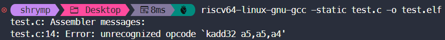

- 安装支持 Linux 静态编译的 RISC-V GCC 工具链 和 QEMU 模拟器

  ```
  sudo apt update
  sudo apt install -y gcc-riscv64-linux-gnu qemu-user-static
  ```

- 编译：`riscv64-linux-gnu-gcc -static test.c -o test.elf`
- 运行：`qemu-riscv64-static ./test.elf`

```c
#include <stdio.h>

int main() {
    int a = 0x7FFFFFFF; // 32位最大正整数
    int b = 1;
    int res_normal, res_saturate;

    // 1. 普通加法
    res_normal = a + b;

    // 2. 尝试调用 P 扩展的饱和加法 (kadd32)
    // 注意：这里我们使用内联汇编的特殊写法
    // 如果你的编译器报错 "unknown instruction", 说明它还没支持 P 扩展助记符
    asm volatile (
        "kadd32 %0, %1, %2"
        : "=r"(res_saturate) 
        : "r"(a), "r"(b)
    );

    printf("普通加法结果 (溢出): %d\n", res_normal);
    printf("P扩展饱和加法结果: %d\n", res_saturate);

    return 0;
}
```

